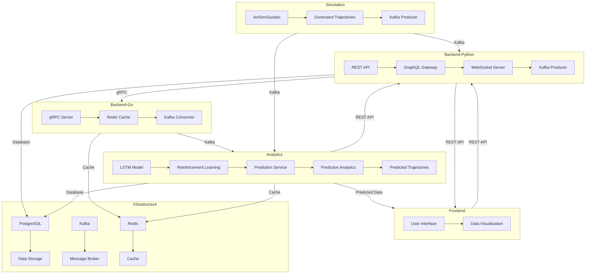

# Architecture Document

## Overview
The **Quadrocopter Management System** is a microservice-based project designed to manage quadcopters using predictive analytics and reinforcement learning. The architecture is modular, scalable, and designed to handle real-time data efficiently. It leverages cutting-edge technologies such as Docker, Kubernetes, Kafka, and advanced machine learning frameworks.

---

## High-Level Architecture

### Key Components
- **Frontend**: Provides a user interface for monitoring quadcopter trajectories, real-time data, and analytics results.
- **Backend (Python)**: Acts as the main API layer, integrating analytics and simulation results, and exposing endpoints for the frontend.
- **Backend (Go)**: High-performance services for data processing, caching, and gRPC communication.
- **Simulation**: Generates synthetic training data using simulators like AirSim and Gazebo.
- **Analytics**: Predictive analytics and reinforcement learning models for trajectory prediction and stabilization.
- **Infrastructure**: Kafka for real-time messaging, PostgreSQL for data storage, Redis for caching, and Kubernetes for orchestration.

### Diagram

---

## Components Description

### **Frontend**
- **Technology**: React.js
- **Features**:
  - Visualizes quadcopter trajectories.
  - Real-time updates using WebSockets.
  - Data dashboards with D3.js and Chart.js.

### **Backend (Python)**
- **Technology**: FastAPI, GraphQL, gRPC.
- **Responsibilities**:
  - Central API gateway for all interactions.
  - Handles analytics requests and data integration.
  - WebSocket support for real-time updates.
  - Error logging and monitoring via ELK stack (Elasticsearch, Logstash, Kibana).

### **Backend (Go)**
- **Technology**: Gin/Echo, Redis, gRPC.
- **Responsibilities**:
  - High-performance data processing.
  - Caching intermediate results for fast access.
  - Handles high-throughput gRPC requests from Python backend.

### **Simulation**
- **Technology**: Python, AirSim/Gazebo.
- **Responsibilities**:
  - Generates realistic flight data for training and testing.
  - Sends data streams to Kafka for downstream components.

### **Analytics**
- **Technology**: Python, TensorFlow, PyTorch, Stable-Baselines3.
- **Responsibilities**:
  - Predictive analytics using LSTM/GRU models.
  - Reinforcement learning for quadcopter stabilization.
  - Sim-to-Real Transfer for real-world deployment.

### **Infrastructure**
- **Kafka**: Message broker for real-time data streaming.
- **PostgreSQL**: Relational database for persistent storage.
- **Redis**: In-memory cache for fast data access.
- **Kubernetes**: Orchestrates microservices, ensuring scalability and fault tolerance.

---

## Data Flow

1. **Simulation Data Generation**:
   - The simulation component generates quadcopter trajectory data and sends it to Kafka.
2. **Analytics**:
   - Data from Kafka is consumed by the analytics module for predictions and RL training.
3. **Backend Integration**:
   - Backend-Python collects predictions and serves them to the frontend.
4. **Frontend Interaction**:
   - Users interact with the frontend to view real-time data and analytics.

---

## Technology Stack

### Core Technologies
- **Frontend**: React.js, WebSockets, D3.js, Chart.js
- **Backend**:
  - Python: FastAPI, gRPC, GraphQL
  - Go: Gin, Redis, gRPC
- **Simulation**: AirSim, Gazebo
- **Analytics**: TensorFlow, PyTorch, Stable-Baselines3, OpenAI Gym
- **Infrastructure**: Docker, Kubernetes, Kafka, PostgreSQL

---

## Deployment and Scalability

### Orchestration
- Kubernetes manages microservices, enabling horizontal scaling of high-demand components.

### Fault Tolerance
- Kafka ensures message durability and asynchronous processing.
- Kubernetes automatically restarts failed pods.

### CI/CD
- GitHub Actions for automated testing and deployment.

---

## Key Scenarios

1. **Real-Time Data Monitoring**:
   - Simulation sends trajectory data to Kafka.
   - Backend processes data and updates the frontend in real-time.

2. **Predictive Analytics**:
   - Backend requests predictions from the analytics component.
   - Analytics returns the predicted trajectory to the backend.

3. **Reinforcement Learning**:
   - Analytics trains RL models using simulation data.
   - Trained models are deployed for real-world scenarios.

---

## Challenges and Solutions

| Challenge                       | Solution                                                                 |
|---------------------------------|--------------------------------------------------------------------------|
| High latency in data transfer   | Use Kafka for real-time messaging and Redis for caching.                 |
| Complexity in debugging         | Implement distributed tracing with Jaeger or Zipkin.                     |
| Resource management in Kubernetes | Use resource quotas and auto-scaling policies in Kubernetes.            |
| Sim-to-Real Transfer difficulties | Incorporate domain randomization techniques in simulation data.          |

---

## Future Enhancements
- Integration with Prometheus and Grafana for performance monitoring.
- Support for real-world quadcopters using IoT frameworks.
- Advanced RL techniques for dynamic obstacle avoidance.

---

## Conclusion
This architecture is designed to be modular, scalable, and efficient. It leverages modern technologies to ensure real-time performance and seamless integration of components. By adhering to this architecture, the project lays a solid foundation for success.
